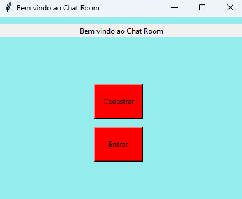
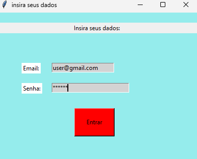
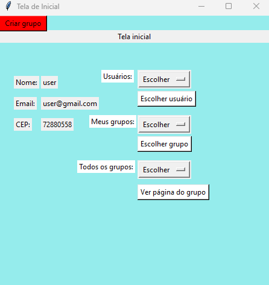
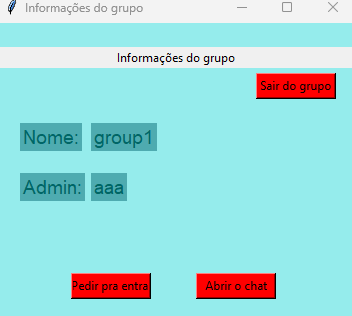
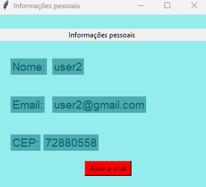
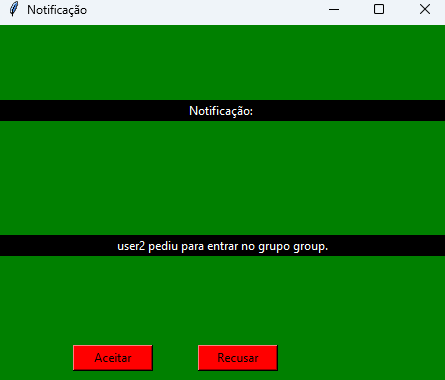
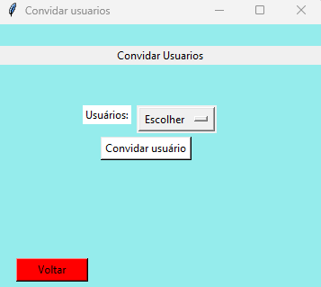
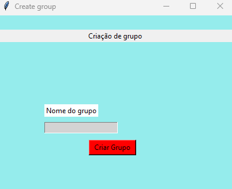
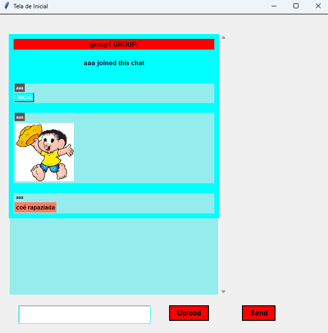

<p align="center">Chat em Grupo</p>

<ul>
    <li><a href="#-sobre-o-projeto">💬 Sobre o projeto</a></li>
    <li><a href="#-tecnologias">🛠 Tecnologias</a></li>
    <li><a href="#-funcionalidades"> Funcionalidades</a></li>
    <li><a href="#-autores">💻 Autores</a>
</ul>

---

<h2>💬 Sobre o projeto</h2>

<p>Esse documento é um relatório do Primeiro Projeto de Aplicação da Disciplina de Redes da <a href="https://www.unb.br/" target="_blank">Universidade de Brasília</a>. Com o objetivo de colocar em pratica o conhecimento teórico a respeito de Programação com Sockets, Paradigma de Cliente e Servidor e Sistemas de Redes, o grupo desenvolveu uma Aplicação de Chat em grupo utilizando esses conceitos e desenvolvendo uma interface simples para demonstrar as funcionalidades.</p>

---

<h2>🛠 Tecnologias</h2>

<p></p>

<p>A aplicação foi desenvolvida utilizando a linguagem de programação Python e alguns pacotes desenvolvidos com a mesma linguagem. Para a comunicação entre clientes e o servidor, utilizamos sockets fornecidos pela biblioteca socket e configurados com especificações para seguir o protocolo TCP de transporte. Devido à necessidade de alguns processos da aplicação funcionarem simultaneamente a outros, precisávamos utilizar threads por meio da biblioteca “threading”. Na parte do cliente, utilizamos também o Tkinter para criar a interface principal, além do auxílio do “Pillow” para a renderização das imagens em um chat, do “PyGame” para tocar áudios e da biblioteca “re” para algumas validações por meio de expressões regulares (como a de e-mail). Além disso, optamos por utilizar a programação orientada a objetos tanto no cliente quanto no servidor para encapsular melhor as funcionalidades comuns a um usuário, um grupo, etc.</p>

<p>Pacotes necessários:</p>

```
    pip install Pillow
    pip install pygame
```
Iniciar o servidor
```
    cd server
    py main.py
```
Iniciar o cliente
```
    cd client
    py main.py
```
---

<h2> Funcionalidades</h2>

<p>O usuário pode trocar mensagens diretamente com outro usuário ou em um grupo. Para participar de um grupo, o usuário deve pedir para entrar, ser convidado ou criar seu próprio grupo. Ao criar um grupo, o usuário poderá receber notificações de pedidos para entrar em seu grupo, além das notificações de convite para grupos que qualquer usuário pode receber. Na troca de mensagens, os usuários poderão enviar imagens e áudios. As telas desenvolvidas para o projeto estão disponíveis abaixo.</p>
















<h2>💻 Autores</h2>

<table>
  <tr>
    <td align="center"><a href="https://github.com/isasisnando" target="_blank"><br /><sub><b>Isa Sousa</b></sub></a><br /></td>
    <td align="center"><a href="https://github.com/lucasdbr05" target="_blank"><br /><sub><b>Lucas Lima</b></sub></a><br /></td>
    <td align="center"><a href="https://github.com/EmersonJr" target="_blank"><br /><sub><b>Emerson Junior</b></sub></a><br /></td>
</table>
